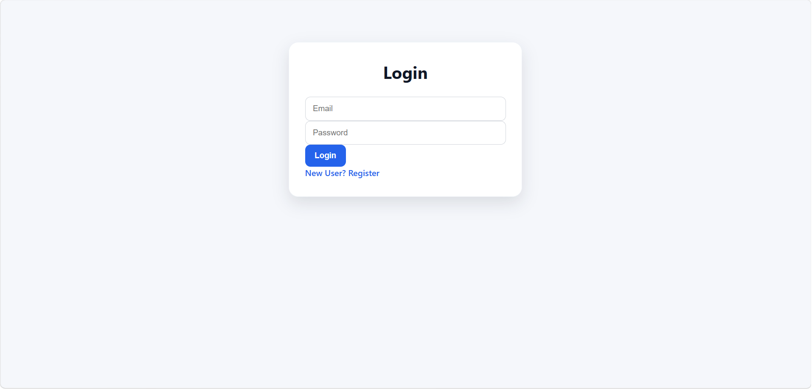
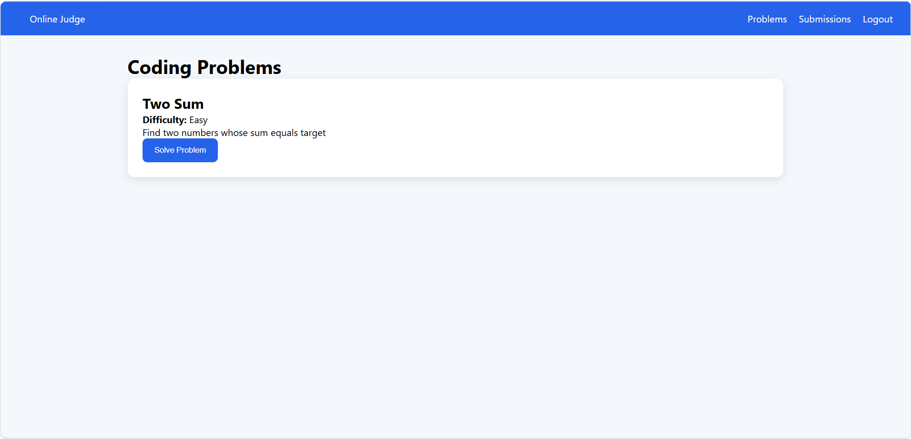
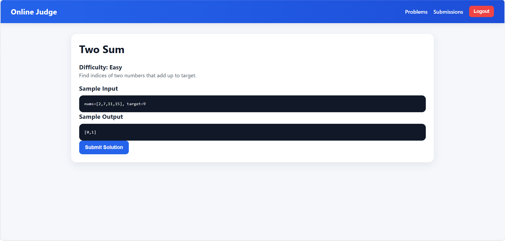
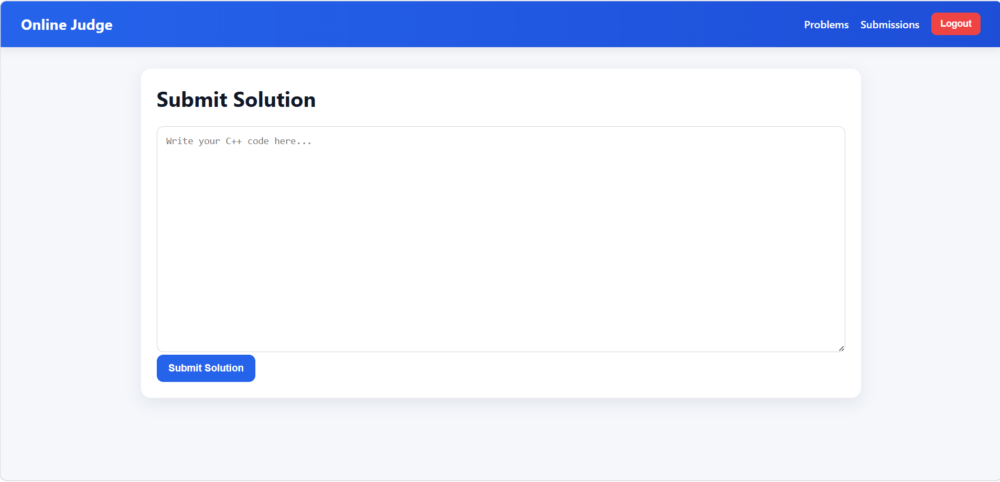
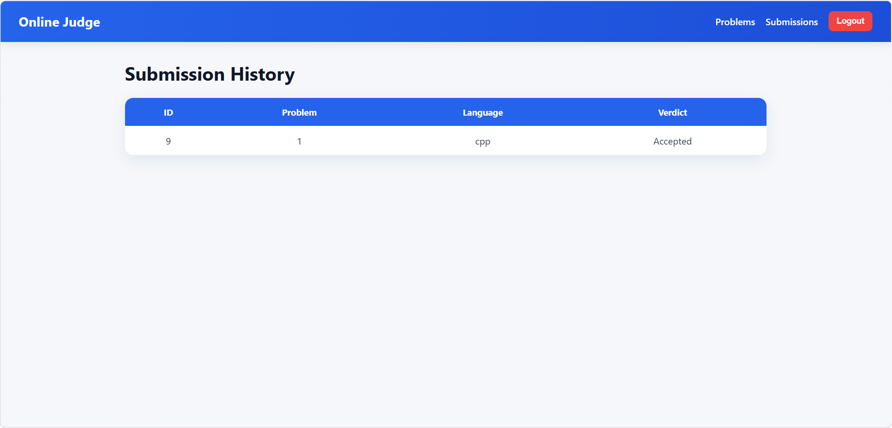
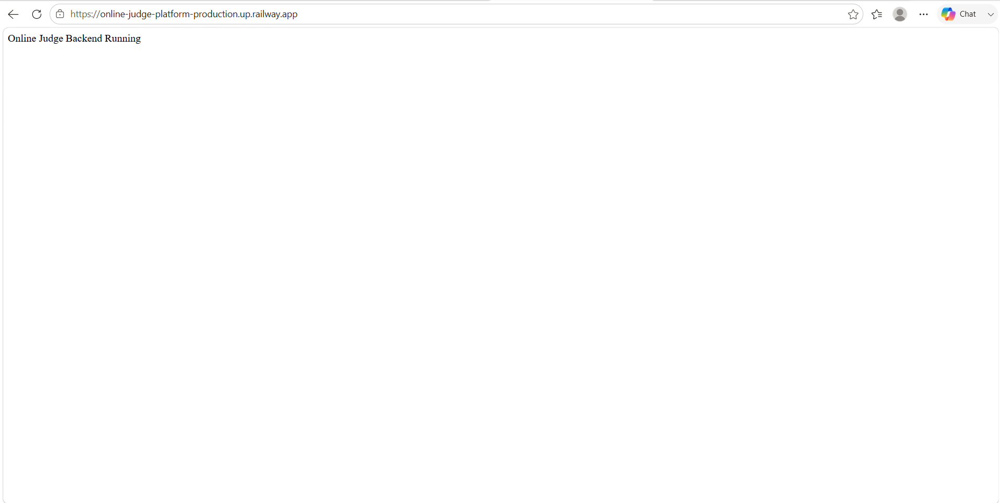
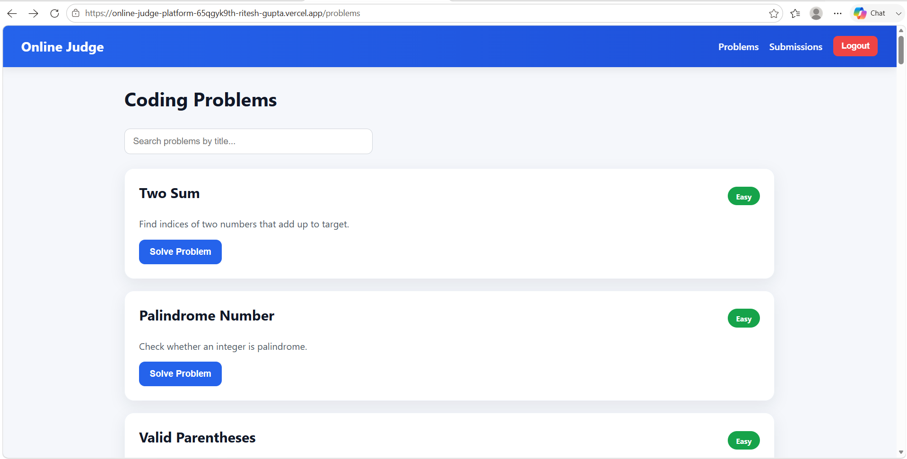

#  Online Judge Platform

A full-stack coding platform that allows users to register, solve coding problems, submit solutions, and track their submission history. The platform provides authentication, problem management, submission tracking, search functionality, difficulty classification, and cloud deployment.

---

##  Live Demo

### Frontend (Vercel)

https://online-judge-platform-65qgyk9th-ritesh-gupta.vercel.app/

### Backend (Railway)

https://online-judge-platform-production.up.railway.app/

### Source Code

https://github.com/ritesh30gupta06/online-judge-platform

---

#  Features

## Authentication

* User Registration
* User Login
* JWT Authentication
* Protected Routes

## Problem Management

* 50 Coding Problems
* Easy, Medium, Hard Classification
* Tag-Based Categorization
* Problem Details Page
* Search Functionality

## Submission System

* Code Submission
* Verdict Generation
* User-Specific Submission History

## Deployment

* Frontend Hosted on Vercel
* Backend Hosted on Railway
* MySQL Database Hosted on Railway

---

#  Tech Stack

### Frontend

* React.js
* React Router DOM
* Axios
* CSS

### Backend

* Node.js
* Express.js
* JWT Authentication
* REST APIs

### Database

* MySQL

### Cloud Platforms

* Vercel
* Railway

---

#  Screenshots

## Login Page



---

## Register Page


---

## Problems Dashboard



---

## Problem Details



---

## Submit Solution



---

## Submission History



---

## Railway Backend Deployment



---

## Live Website Deployment



---

#  Project Highlights

* Built a complete full-stack coding platform from scratch.
* Implemented secure JWT-based authentication.
* Developed RESTful APIs using Express.js.
* Designed MySQL database schema for users, problems, and submissions.
* Created user-specific submission history functionality.
* Integrated search functionality for coding problems.
* Added difficulty badges and tag-based classification.
* Deployed frontend, backend, and database on cloud platforms.
* Managed 50 coding challenges with structured problem organization.

---

#  Database Schema

## Users Table

| Column   |
| -------- |
| id       |
| name     |
| email    |
| password |

---

## Problems Table

| Column        |
| ------------- |
| id            |
| title         |
| difficulty    |
| description   |
| sample_input  |
| sample_output |
| expected_code |
| tag           |
| created_at    |

---

## Submissions Table

| Column       |
| ------------ |
| id           |
| user_id      |
| problem_id   |
| code         |
| language     |
| verdict      |
| submitted_at |

---

#  Project Structure

```text
onlinejudge
│
├── backend
│   ├── config
│   ├── controllers
│   ├── middleware
│   ├── routes
│   ├── server.js
│   └── package.json
│
├── frontend
│   ├── src
│   │   ├── pages
│   │   ├── components
│   │   ├── services
│   │   ├── App.jsx
│   │   └── main.jsx
│   │
│   └── package.json
│
├── screenshots
│   ├── login.png
│   ├── register.png
│   ├── problems.png
│   ├── problem-details.png
│   ├── submit-solution.png
│   ├── submissions.png
│   ├── railway.png
│   └── deployed-site.png
│
└── README.md
```

---

#  Installation

## Clone Repository

```bash
git clone https://github.com/ritesh30gupta06/online-judge-platform.git
```

```bash
cd online-judge-platform
```

---

## Backend Setup

```bash
cd backend
npm install
npm start
```

---

## Frontend Setup

```bash
cd frontend
npm install
npm run dev
```

---

#  Deployment

### Frontend

Deployed using Vercel.

### Backend

Deployed using Railway.

### Database

MySQL Database hosted on Railway.

---


#  Author

### Ritesh Gupta

GitHub:
https://github.com/ritesh30gupta06

---

 If you found this project useful, consider giving it a star on GitHub.
